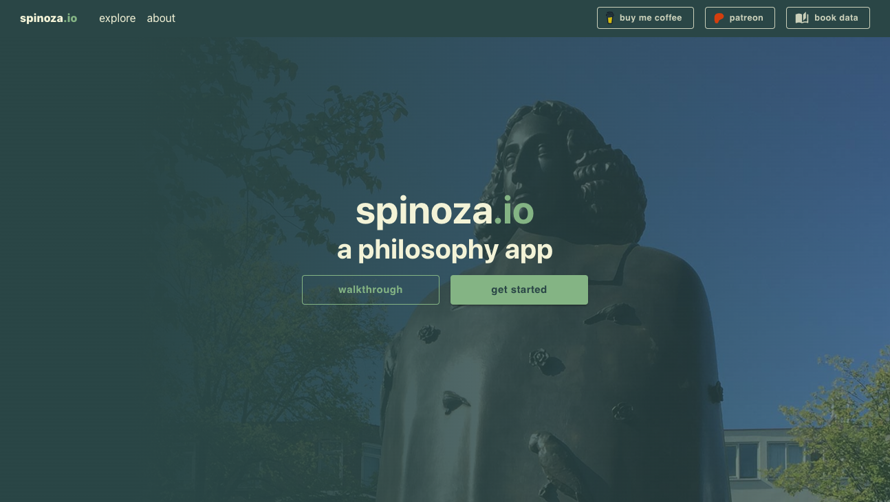
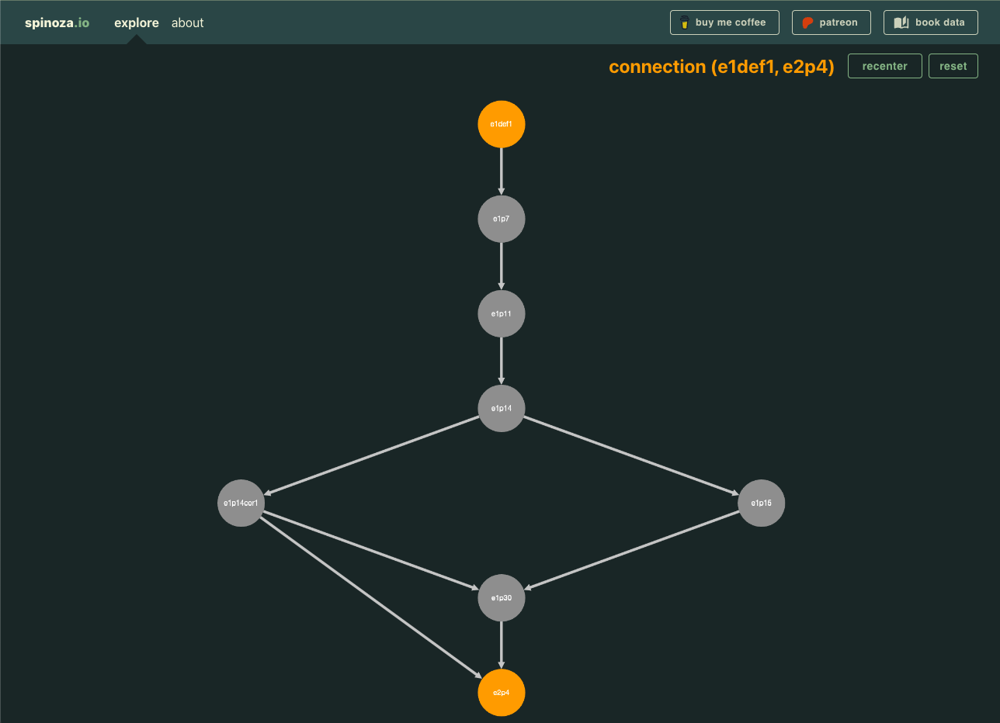

[Try it out!](https://spinoza.io/)

An application for exploring [Spinoza's Ethics](https://en.wikipedia.org/wiki/Spinoza%27s_Ethics). The idea for building this app is what inspired me to learn to code a long time ago. Currently the application is fully functional, only missing the long and arduous work of transcribing multiple translations of the book into the application itself.

Unfortunately, E. Curley has not given me permission to use his great English translation for this project. The old Elwes translation that is now public domain is riddled with mistakes, and for that reason I've left this project on pause. I rather have a high quality translation in English to supply via the application than one that creates confusion due to mistakes.

